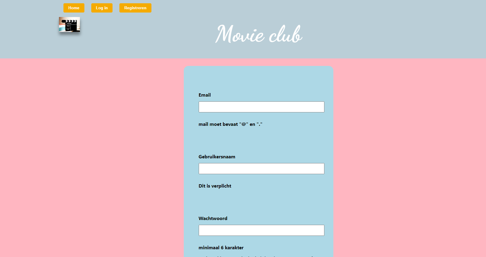

1. installeer je eerst Webstorm in jouw computer.

   https://www.jetbrains.com/webstorm/download/#section=windows

2. installeer je tweede Node.js.

   https://nodejs.org/en/download/

   Je kan testen of de installatie succesvol was door het volgende commando in de terminal te typen en dan op enter te drukken:
   
   node -v

   Als Node.js aanwezig is zul je een versienummer te zien krijgen, zoals bijvoorbeeld v13.9.3. Krijg je een andere melding, zoals bijvoorbeeld node: command not found dan is het nog niet (juist) geïnstalleerd.

3. Installeer je eerst de node_modules door het volgende commando in de terminal van Webstorm te runnen:

    npm install

4. Wanneer dit klaar is, kun je de applicatie starten met behulp van:

    npm start

    of gebruik de WebStorm knop (npm start). Open http://localhost:3000 om de pagina in de browser te bekijken.

5. Workflow

    a. Om dit applicatie te gebruiken, je moet een account registreren.

   

    b. Om dit applicatie te gebruiken, je moet je account inloggen.

    c. Je kan informatie opzoeken in profile page. Om het te vinden, je moet aan de volgende voorwaarden voldoen:
    1. Schrijft naam van film(verplicht)
    2. Schrijft exacte releasedatum(optioneel)
    3. Kiezen van movie, series of game

    d. Je kan jouw favorieten toevoegen naar favorieten page.

    e. Je kan jouw favorieten verwijderen vanuit favorieten page.

    f. Je kan meest informatie van movie, series en game vinden in deze applicatie, maar niet alles.

    g. Niet alle informatie bevat met foto.